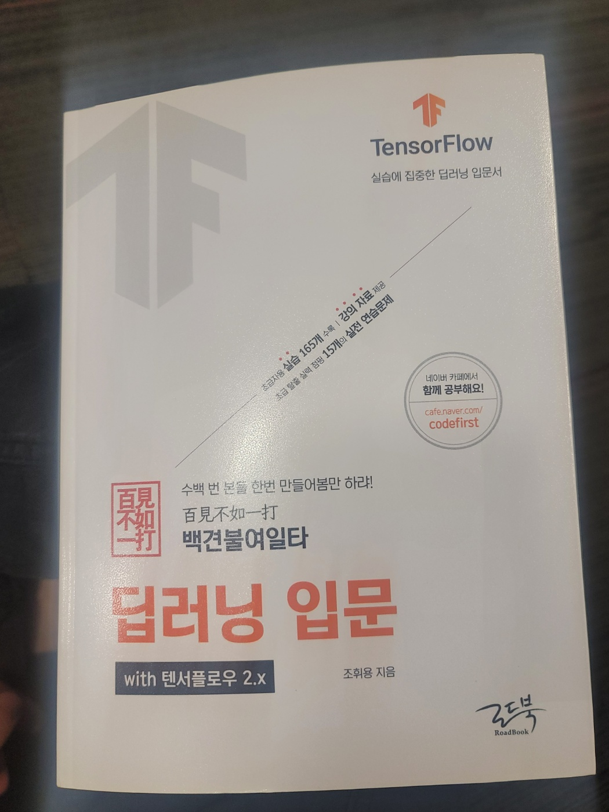

딥러닝에 대한 이론적인 설명과 이를 구현하는 텐서플로우 코드를 설명하고 있습니다. 텐서플로우를 깊게 배우려는 생각은 아니고, 딥러닝 이론이 어떻게 텐서플로우, 케라스로 적용되는지 흐름만 알기 위해서 읽어봤습니다. 교보문고에서 앉아서 읽느라 직접 코드실행 못한 부분도 있습니다 ㅎㅎ... 이론적인 부분은 꼼꼼하게 읽으면서 환경설정이나 코드는 흐름만 파악했습니다. (nvdia 드라이버를 설치하네.., cuda 를 설치하네..,코랩에서는 gpu 환경사용이 가능하네 등등)

원핫인코딩, 과소표집 과대표집, 하이퍼파라미터, 에폭과 스텝 등등 용어도 한번 정리할 수 있었습니다. 그리고 **혼동행렬**이라는 아주 중요한 모델 예측 기준을 알 수 있었습니다. 혼동행렬은 예측값과 실제값을 비교해서 정확도, 재현도, 정밀도, F 스코어를 계산하고 모델의 목적 따라 재현도나 정밀도를 높이는 데 사용됩니다.

그리고 ROC 곡선도 있는데 민감도와 특이도를 통해 모델의 성능을 측정할 수 있습니다.

- 혼동행렬 관련돼서 괜찮은 글 : https://diseny.tistory.com/entry/%ED%98%BC%EB%8F%99%ED%96%89%EB%A0%ACconfusion-matrix
- ROC 곡선 관련돼서 괜찮은 글 : https://diseny.tistory.com/entry/ROC-%EA%B3%A1%EC%84%A0-%EC%95%84%EC%A3%BC-%EC%89%BD%EA%B2%8C-%EC%9D%B4%ED%95%B4%ED%95%98%EA%B8%B0

후반부에는 tensorflow 로 데이터 처리부터 모델 학습까지 설명해놓았는데 플로우만 봤습니다. 

1. 데이터다운
2. 전처리
3. 모델구성 - 소프트맥스, 손실함수, 옵티마이저, 평가지표 등
4. 모델 학습 - 배치와 에포크
5. 예측 및 정답 비교