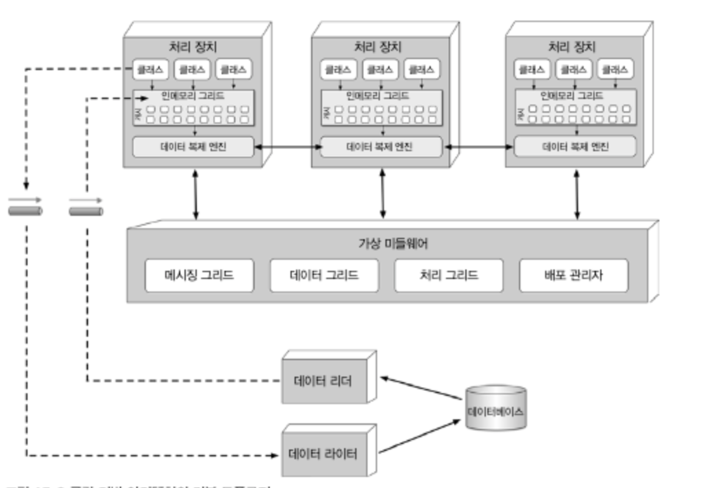
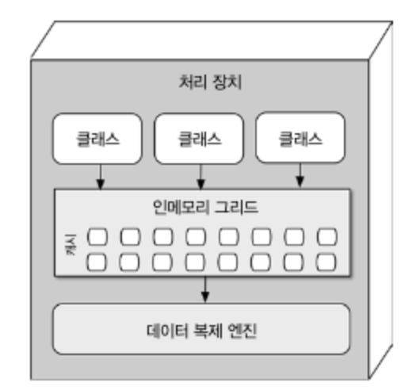
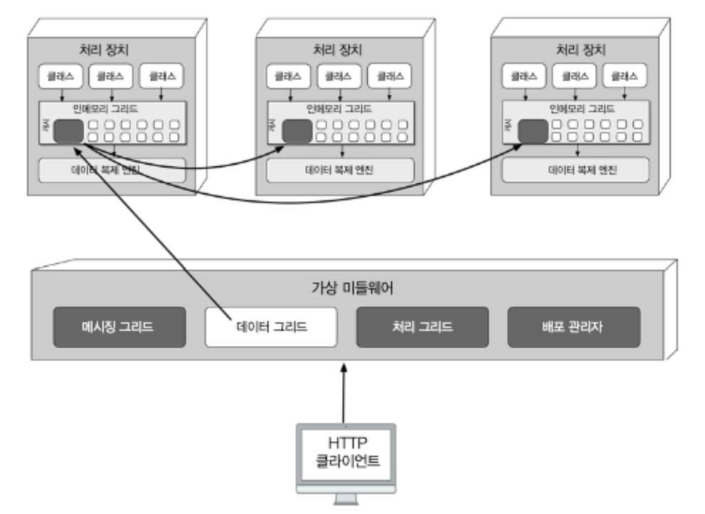
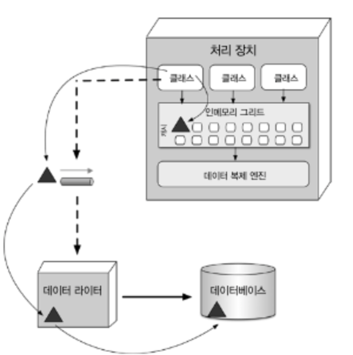
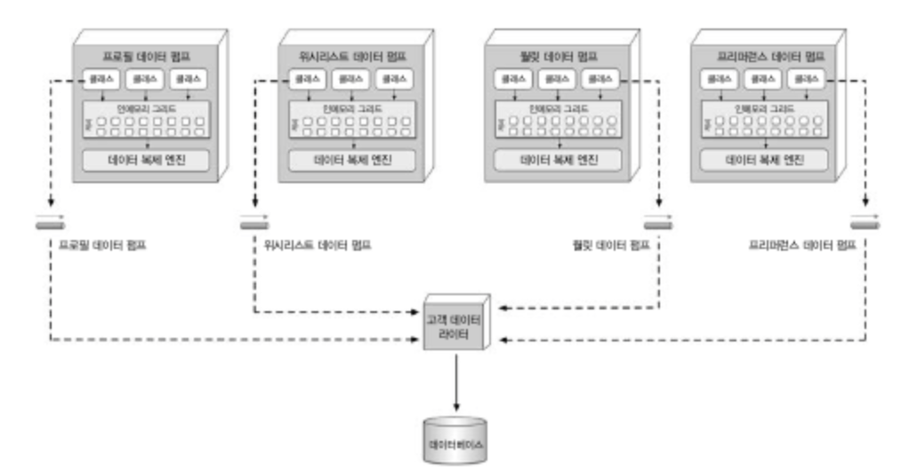
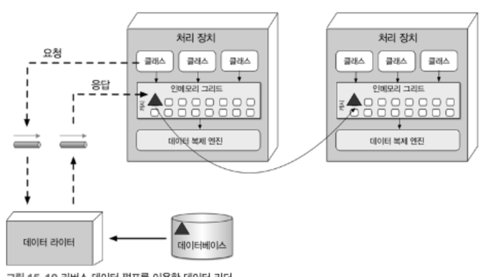
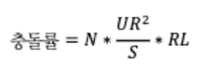
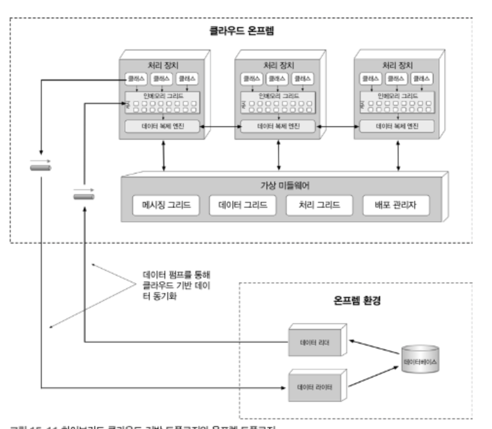
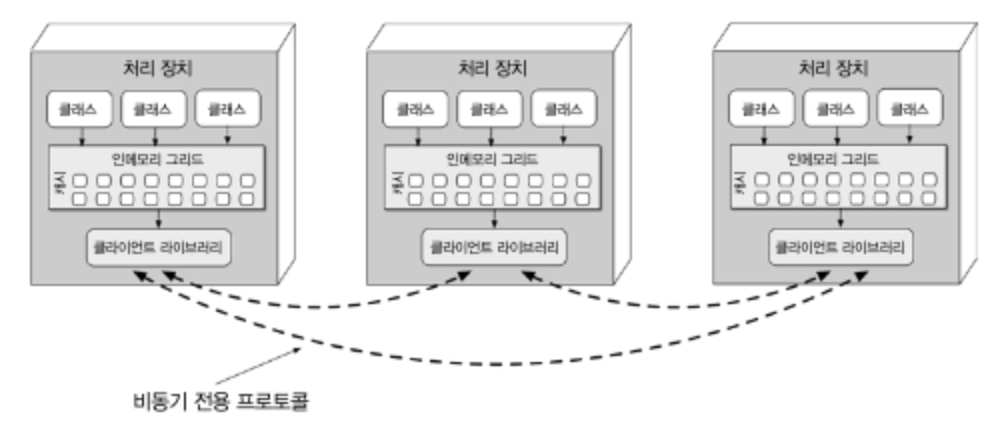
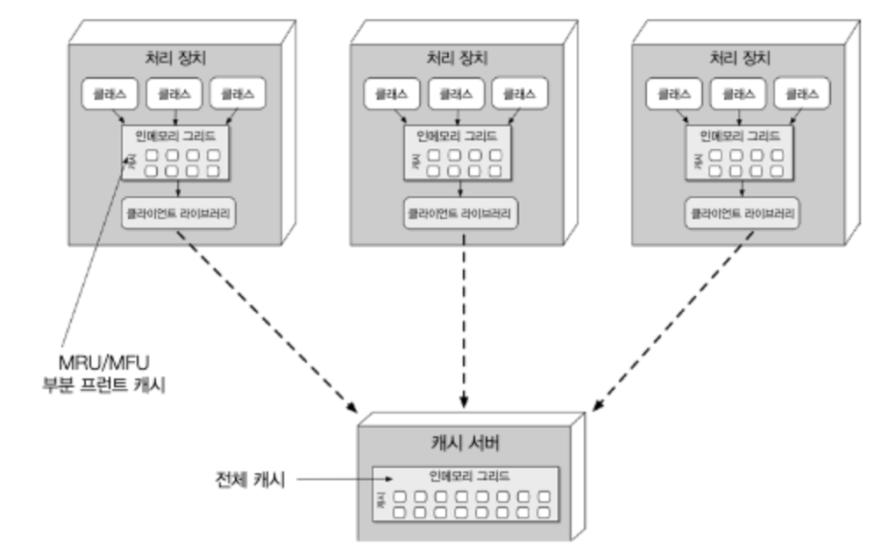

  공간 기반(space-based) 아키텍처 스타일은 높은 확장성, 탄력성, 동시성 및 이와 관련된 문제를 해결하기 위한 아키텍처 스타일입니다. 또한 **동시 유저 수가 매우 가변적이라서 예측 불가능한 애플리케이션에 유리합니다.**

# 1. 토폴로지

  시스템에서 동기 제약조건인 중앙 데이터베이스를 없애고 복제된 인메모리 데이터 그리드를 활용하여 확장성, 탄력성, 성능을 높입니다. 애플리케이션 데이터는 메모리에 두고, 데이터 업데이트 시 퍼시스턴스 큐에 메시지를 보내는 식으로 데이터베이스에 데이터를 비동기로 전송합니다. 공간 기반 아키텍처는 애플리케이션 코드가 구현된 처리 장치, 처리 장치를 관리/조정하는 가상 미들웨어, 업데이트된 데이터를 DB 에 비동기 전송하는 데이터 펌프, 데이터를 업데이트하는 데이터 라이터, 데이터를 전달하는 데이터 리더가 있습니다.

## 1.1 처리장치

  처리 장치는 애플리케이션 로직입니다. 인메모리 데이터 그리드 및 복제 엔진도 처리 장치에 포함됩니다.

## 1.2 가상 미들웨어

  가상 미들웨어는 아키텍처 내부에서 데이터 동기화 및 요청 처리의 다양한 부분을 제어하는 인프라를 담당합니다.

### 1.2.1 메시징 그리드

  메시징 그리드는 입력 요청과 세션 상태를 관리합니다. 웹 서버의 기능을 담당합니다.

### 1.2.2 데이터 그리드

  데이터 그리드는 거의 대부분 복제 캐시로서 처리 장치에만 구현되어 있지만, 외부 컨트롤러가 필요한 복제 캐시 구현체나 분산 캐시를 사용할 경우 데이터 그리드는 가상 미들웨어 내부의 데이터 그리드 컴포넌트와 처리 장치 모두에 위치합니다.

  처리 장치 어디에서건 캐시 변경 사항이 발생한다면 해당 변경사항은 모든 처리 장치에 복제됩니다. 따라서 처리 장치는 어떤 인스턴스에 복제해야 하는지에 대한 정보를 가지고 있습니다.

### 1.2.3 처리 그리드

  처리 그리드는 다수의 처리 장치가 단일 비즈니스 요청을 처리할 경우 요청 처리를 오케스트레이트하는 일을 합니다.

### 1.2.4 배포 관리자

  배포 관리자는 부호 조건에 따라 처리 장치를 동적으로 시작/종료합니다.

## 1.3 데이터 펌프

  데이터 펌프는 데이터를 다른 프로세서에 보내 데이터베이스를 업데이트하는 장치입니다. 항상 비동기로 작동하며 캐시와 데이터베이스 사이의 최종 일관성을 실현합니다.

### 1.4 데이터 라이터

  데이터 라이터는 데이터 펌프에서 메시지를 받아 데이터베이스를 업데이트합니다. 데이터 라이터는 특정 도메인 전체 업데이트를 처리하는 모든 데이터베이스 로직을 갖고 있을 수도 있고, 처리 장치 클래스마다 자체 전용 데이터 라이터를 두는 경우도 있습니다.

## 1.5 데이터 리더

  데이터 리더는 데이터베이스에서 데이터를 읽어 리버스 데이터 펌프를 통해 처리 장치로 실어 나르는 컴포넌트입니다. 데이터 리더는 세 가지 경우에만 작동합니다.

1. 동일한 이름의 캐시를 가진 모든 처리 장치 인스턴스가 실패하는 경우
2. 동일한 이름의 캐시 안에서 모든 처리 장치를 재배포하는 경우
3. 복제 캐시에 들어있지 않은 아카이브 데이터를 조회하는 경우

  예를 들어서 시스템 장애로 인스턴스가 모조리 다운된 후 다시 시작할 때 인스턴스는 데이터베이스에서 데이터를 읽어와야 합니다. 인스턴스는 락을 획득하고 데이터를 요청하는 큐에 메시지를 보내 캐시를 로드합니다. 

# 2. 데이터 충돌

  동일한 캐시가 포함된 서비스 인스턴스에서 복제 캐시를 사용하면 복제 레이턴시 때문에 데이터 충돌이 발생할 수 있습니다. 예를 들어 한 캐시 인스턴스(A) 에서 데이터가 업데이트 되어 다른 캐시 인스턴스(B) 에 복제하는 도중 동일한 데이터가 해당 캐시(B) 에서 업데이트되는 현상입니다. 각자의 로컬 업데이트는 복제된 데이터때문에 덮어씌워지는 불상사가 발생합니다.

  데이터 충돌률은 아래와 같이 수학적으로 계산할 수 있습니다.

- N : 동일한 이름의 캐시를 사용하는 인스턴스 수
- UR : 밀리초 당 업데이트율
- S : 캐시 크기 (로우 개수)
- RL : 캐시 제품의 복제 대기 시간

  여기서 캐시 크기가 유일하게 충동률과 반비례 관계인 팩터입니다.

# 3. 클라우드 대 온프레미스 구현

  공간 기반 아키텍처는 클라우드와 온프레미스 두 환경에서 모두 배포할 수 있습니다.

  예를 들어 트랜잭션은 탄력적인 동적 클라우드 기반 환경에서 처리하되, 물리적인 데이터 관리, 리포팅, 데이터 분석은 안전한 로컬 온프레미스 환경에 보관할 수 있습니다.

# 4. 복제 캐시 대 분산 캐시

  

  위와 같이 복제 캐시를 사용할 경우 모든 처리 장치 간에는 동기화되는 자체 인메모리 데이터 그리드를 갖습니다. 한 처리 장치에서 캐시가 업데이트되면 다른 처리 장치도 새로운 데이터로 자동 업데이트되는 구조입니다.

  복제 캐시는 속도가 매우 빠르고 단일 장애점이 없습니다. 하지만 데이터량이 엄청나게 많거나 캐시 데이터가 너무 빈번하게 업데이트되는 등 복제 캐시를 사용할 수 없는 경우도 있습니다. 이런 경우 분산 캐시를 사용하면 도움이 됩니다.

  분산 캐시를 구현하려면 중앙 캐시를 갖고 있는 전용 외부 서버 또는 서비스가 필요합니다. 분산 캐시는 높은 수준의 데이터 일관성을 보장하지만, 복제 캐시보다 성능이 낮고 시스템 전체 레이턴시가 증가합니다. 또한 내고장성도 문제입니다.

# 5. 니어 캐시

  니어 캐시(near-cache) 는 분산 캐시와 인메모리 데이터 그리드를 접합한 하이브리드 캐시 모델입니다. 분산 캐시는 풀 백킹 캐시(full backing cache), 각 처리 장치에 포함된 인메모리 데이터 그리드는 프론트 캐시라고 합니다. 프론트 캐시는 MRU(Most Recently Used) 또는 MFU(Most Frequently Used) 캐시로 사용합니다. 프론트 캐시는 항상 풀 백킹 캐시와 동기화 되지만 각 처리 장치의 프론트 캐시 간에는 동기화되지 않습니다. **이처럼 처리 장치마다 상이한 데이터를 갖게 되면 처리 장치 간 성능과 응답성의 일관성이 결여되므로 공간 기반 아키텍처에서 니어 캐시 모델은 권장되지 않습니다.**

