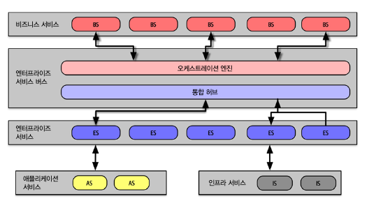
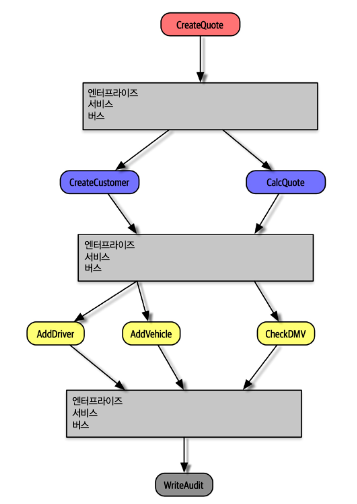
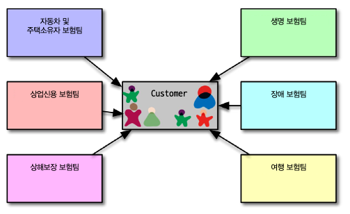

# 1. 역사와 철학

  1990년대 후반 기업들의 인수 합병으로 아키텍처를 합치기 위해 고안된 분산 아키텍처입니다. 이 시대에는 오픈 소스가 아닌 라이센스를 구매해서 사용했기 때문에 시스템 단위로 구축했습니다. 그 결과 모든 형태의 재사용이 이 아키텍처의 중심 철학이 되었습니다.

# 2. 토폴로지

  아키텍처 내부에 서비스 텍소노미(taxonomy, 분류체계) 를 정립하여 레이어별로 책임을 지운다는 아이디어입니다.

# 3. 택소노미

 ## 3.1 비즈니스 서비스

  최상단에 위치한 비즈니스 서비스는 진입점의 역할을 합니다. 입력, 출력, 스키마 정보만 가지고 있습니다.

## 3.2 엔터프라이즈 서비스

  엔터프라이즈 서비스는 세분화된 공유 구현체로, 특정 비즈니스 도메인에 관한 원자적 행위를 구현합니다. 재사용 목표를 위해 책임을 분리했습니다. 

## 3.3 애플리케이션 서비스

  애플리케이션 서비스는 엔터프라이즈 서비스와 달리 한 번만 사용 가능한 단일 구현체 서비스입니다.

## 3.4 인프라 서비스

  모니터링, 로깅, 인증/인가 등의 운영 관심사를 지원합니다.

## 3.5 오케스트레이션 엔진

  오케스트레이션 엔진은 비즈니스 서비스 구현체를 서로 엮어주며 트랜잭션 조정과 메시지 변환 등의 기능을 수행합니다. 트랜잭션 로직은 DB 가 안인 오케스트레이션 엔진에서 선언적으로 처리됩니다. 또한 비즈니스와 엔터프라이즈 서비스의 관계, 매핑방법 등도 정의합니다. 

  트랙잭셔널 로직을 오케스트레이션 도구에 위임하는 아이디어는 그럴 듯했으나, 트랜잭션 경계가 어디쯤인지 알아내야 하기 때문에 아키텍처는 복잡해집니다.

## 3.6 메시지 흐름

  모든 요청은 오케스트레이션 엔진을 흘러가며, 내부 호출 시에도 메시지는 엔진을 경유합니다.

# 4. 재사용과 커플링

  위 그림은 서비스 지향 이키텍처 형태로 customer 서비스를 분리해 재사용하는 모습입니다. 이 설계에는 몇가지 부작용이 있습니다. 첫번째로 컴포넌트 간의 커플링이 심하게 발생합니다. 또한 Customer 서비스에 고객에 관한 모든 정보를 담아야 하기 때문에 다른 팀에서는 필요없는 정보까지 알아야 합니다.

